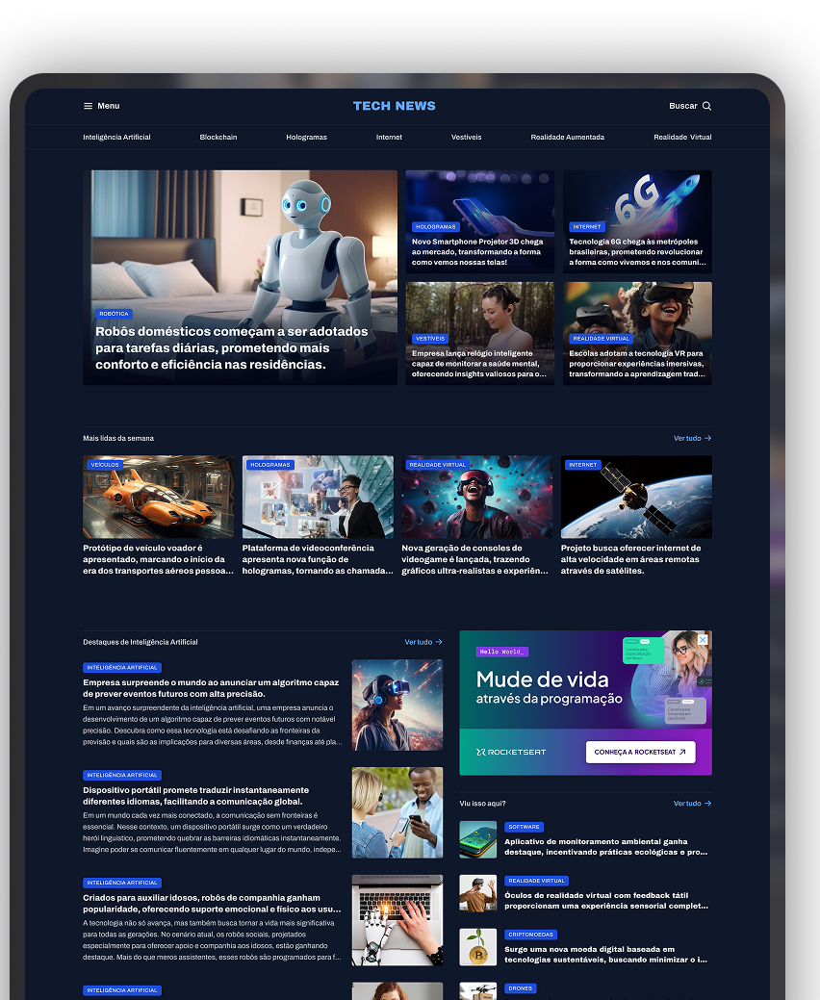

  

# 📰 Portal TechNews

Projeto de um **Portal de Notícias sobre Tecnologia**, criado com foco em aprimorar a aplicação prática de **HTML semântico** e **CSS Grid Layout**, sem o uso de frameworks, bibliotecas ou JavaScript.

## 💡 Sobre o Projeto

Este foi, até o momento, o projeto mais desafiador entre os mais de 10 que desenvolvi individualmente. A proposta foi reproduzir uma experiência real de desenvolvimento web utilizando apenas tecnologias fundamentais — **HTML e CSS** — com ênfase em:

- Responsividade com `CSS Grid` puro
- Estruturação semântica do conteúdo
- Organização modular de estilos
- Construção de um layout editorial consistente

A ideia principal foi simular a criação de um portal informativo moderno, com foco em **experiência de leitura fluida**, **hierarquia visual clara** e **design limpo**.

## 🚀 Experiência Adquirida

Durante esse processo, aprofundei meu domínio em:

- **CSS Grid em nível avançado** — controle preciso de colunas, linhas, áreas nominais e alinhamentos
- **HTML semântico** — utilização correta de tags como `<article>`, `<section>`, `<aside>`, `<nav>` e `<header>`
- **Design editorial responsivo** — aplicação de técnicas de adaptação para diferentes tamanhos de tela sem media queries complexas

Esse projeto reforçou minha capacidade de pensar como desenvolvedor de interfaces responsivas com **atenção extrema aos detalhes de layout e tipografia**.

## 🔗 Acesse o Portal

O projeto está hospedado via GitHub Pages e pode ser acessado pelo link abaixo:

👉 **[Acessar Portal TechNews](https://codebyneander.github.io/portal-news/)**

## 🛠️ Tecnologias Utilizadas

- HTML5
- CSS3 (Grid Layout)
- Git/GitHub

---

## 🙏 Agradecimentos

Este projeto foi desenvolvido como parte de uma atividade proposta pela **Rocketseat**, plataforma da qual sou aluno e que tem sido fundamental no meu crescimento como desenvolvedor.

Sou grato pelo alto nível de conteúdo, pela metodologia prática e pela comunidade ativa que inspira evolução contínua. Sem essa base sólida, projetos como este não estariam no meu radar de execução.

> Obrigado, Rocketseat. 🚀

---

> *"Dominar o básico é o que separa o iniciante do profissional."*  
> Este projeto foi um passo importante nessa direção.

